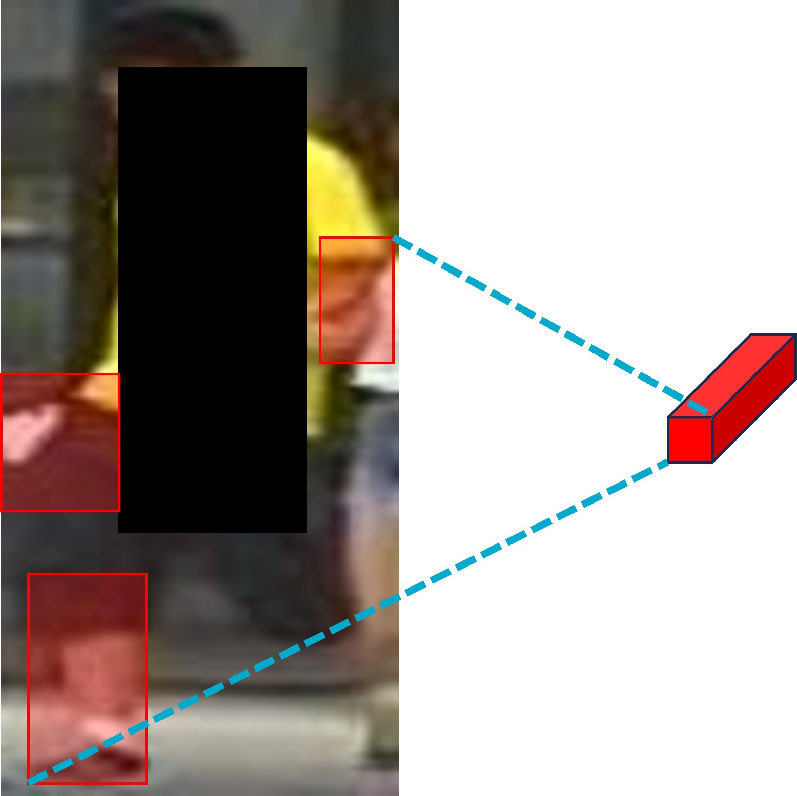

# DIMN
## Deep Information Mining Network for Person Re-identification for ICASSP2024
### Model details.
  We initially horizontally divide the human images into equal segments, ranging from 2 to 6 segments. Two segments represent the relationship between the upper and lower body parts and the entire body. Three segments represent the relationships between the head and chest, waist and abdomen, legs, and the entire body. Four segments represent the relationships between the head and neck, chest and abdomen, thighs, calves, and the entire body. Five segments represent the relationships between the head and neck, chest, abdomen, thighs, calves, and the entire body. Lastly, six segments represent the relationships between the head, chest, abdomen, thighs, calves, feet, and the entire body. For each segmented part, we thoroughly compute the corresponding relationships to fully exploit the information in the human image. As depicted in the figure below, we showcase the information represented by each segmented part after dividing it into six blocks. 
 
  Next, we feed the features from each individual part and the global feature into the network. We employ the RFM module to calculate the relationships between the individual parts and the whole. Finally, we concatenate the feature vectors of the corresponding parts with the feature vector of the whole, enabling the final feature vector of RFM to encompass both local and global information. As shown in the figure below, we demonstrate the fusion of upper-body information into the overall image context. 
 
In the DFM module, we initially devised the first branch, which incorporates global and local features based on segmentation. This allowed us to achieve results similar to other methods. As shown in the following figure, we illustrate the characteristics of the feature vectors after the image is segmented into three parts and processed through the first branch of the DFM.
 
In the DFM, to better utilize the latent information in images (such as handheld items, backpacks, etc.), we have designed a second branch. This branch employs the features obtained after the initial fusion of global and local features to guide our suppression branch in erasing the most salient regions in the image (typically the torso region of the human body). This compels our network to focus on the remaining portions of information, resulting in more discriminative feature vectors. As shown in the figure below, we illustrate the regions of focus in the network after erasing the salient areas. 

 

We utilized the Cross-Entropy (CE) loss function and the Hard Triplet (HTP) loss function as training aids. For further details, please refer to the main text. 
We employed an RTX 4090 GPU to accelerate the training process. The platform was set up on Windows 10, and we primarily utilized PyTorch as the framework. We configured the batch size to 128 and opted for the SGD optimizer. Furthermore, we conducted experiments on two widely available datasets, Market1501 and DukeMTMC, both of which are open-source and available for download. Here are our training results on Market1501: 

 

Our network aims to enhance the recognition of different individuals sharing similar attributes. For specific experimental results, please refer to the main text. After our paper is accepted, we will upload the core code for the three modules.
